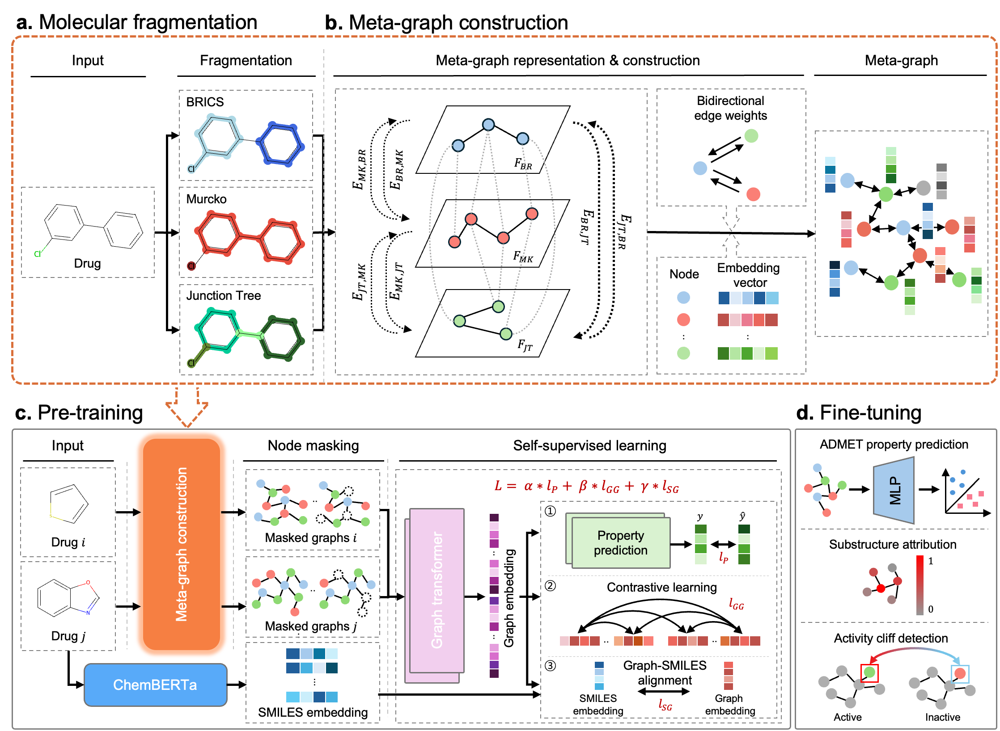

<div align="center">

# Cross-view molecular graph learning enables interpretable ADMET prediction.

**M**ulti-view **A**ggregation of **G**raphs for **N**eural **E**mbedding of **T**opologies

*A multi-view molecular graph learning framework for interpretable ADMET
prediction — combining BRICS / Junction-Tree / Murcko fragmentation,
cross-view meta-graph construction, multi-objective self-supervised
pre-training, and ChemBERTa-augmented fine-tuning.*

</div>

## Overview

<p align="center">
  
</p>

---

## Prerequisites

| Requirement | Notes |
|---|---|
| Python 3.10 | Conda recommended |
| NVIDIA GPU + CUDA | the paper used CUDA 12.8; CPU works but is slow |
| PyTorch + PyTorch Geometric | install builds matching your CUDA toolkit |

---

## Setup

### 1. Environment

```bash
git clone https://github.com/sslim-aidrug/MAGNET.git
cd MAGNET

# create and activate a conda environment
conda create -n magnet python=3.10 -y
conda activate magnet

# install PyTorch for your CUDA toolkit (https://pytorch.org), then
# torch-scatter from the matching PyG wheel index, e.g. for torch 2.11 / CUDA 12.8:
pip install torch-scatter==2.1.2 -f https://data.pyg.org/whl/torch-2.11.0+cu128.html

# remaining dependencies
pip install -r requirements.txt
```

The project root defaults to the repository directory; override with
`--base-dir /path/to/MAGNET` or by exporting `MAGNET_BASE_DIR`. All commands
below assume the `magnet` environment is active.

### 2. Dataset

The **raw inputs** (canonical SMILES + labels) are tracked under `data/raw/`:

```text
data/raw/
├── zinc250k.csv              # pre-training corpus (~250K molecules)
└── moleculenet/              # 10 downstream ADMET benchmarks
    ├── bbbp.csv  bace.csv  hiv.csv  sider.csv  clintox.csv
    ├── tox21.csv  toxcast.csv
    └── esol.csv  freesolv.csv  lipo.csv
```

These derive from public sources — **MoleculeNet** (<https://moleculenet.org/>)
and the **ZINC250K** subset of ZINC (via the Junction-Tree VAE repository,
<https://github.com/wengong-jin/icml18-jtnn>). See `data/raw/README.md` for
provenance.

---

## Run

The pipeline runs in four numbered steps (`scripts/`). Pass a GPU index as the
first argument.

```bash
# 1) Build meta-graphs from the raw CSVs 
bash scripts/step1_build_metagraphs.sh 0

# 2) Generate train/val/test splits 
bash scripts/step2_generate_splits.sh

# 3) Pre-train the GraphGPS encoder on ZINC250K 
bash scripts/step3_pretrain.sh 0
#    -> pretrain_model/pretrained_gps.pt

# 4) Fine-tune on a downstream benchmark over 5 seeds (random + scaffold)
bash scripts/step4_finetune.sh 0 bbbp
#    DATASET in {bbbp, bace, hiv, sider, clintox, tox21, toxcast, esol, freesolv, lipo}
```

---

## Project layout

```text
MAGNET/
├── magnet/                          # Python package (run as `python -m magnet.<module>`)
│   ├── conf.py                      #   argument / path configuration
│   ├── gps_model.py                 #   GraphGPS encoder (FragmentGPS) + projection heads
│   ├── metagraph/                   #   ── core: meta-graph construction ──
│   │   ├── fragmentation.py         #     BRICS / JT / Murcko fragmentation
│   │   ├── graph_builder.py         #     meta-graph assembly + preprocessing pipeline
│   │   ├── node_features.py         #     node features
│   │   └── pos_encoding.py          #     positional / structural encodings
│   ├── pretrain.py                  #   multi-objective pre-training on ZINC250K
│   ├── finetune.py                  #   fine-tuning + multi-seed evaluation
│   └── data_preprocessing/          #   ── data preprocessing ──
│       ├── random_split.py          #     random split
│       └── scaffold_split.py        #     scaffold split
├── scripts/                         # step1-4 pipeline 
│   ├── step1_build_metagraphs.sh
│   ├── step2_generate_splits.sh
│   ├── step3_pretrain.sh
│   └── step4_finetune.sh
├── data/raw/                        # raw input CSVs (ZINC250K + MoleculeNet); processed data gitignored
├── requirements.txt
└── README.md
```

---

## Contact

Corresponding author: Sangsoo Lim (`sslim@dgu.ac.kr`), Department of Computer
Science and Artificial Intelligence, Dongguk University.
